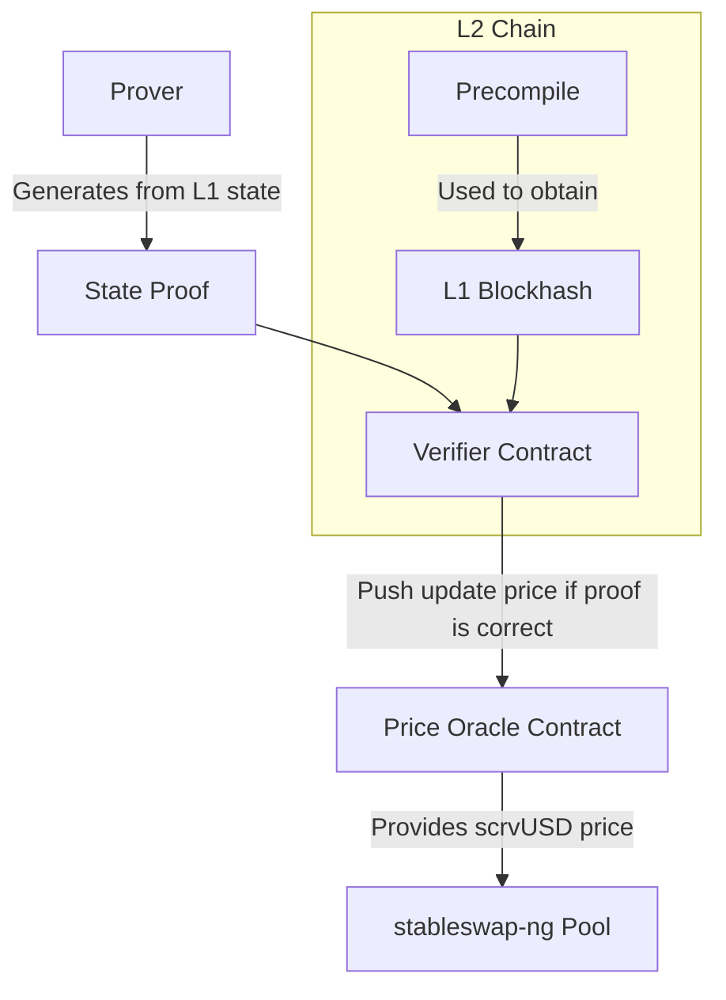

# scrvUSD Price Oracle
## Why is this needed?
### Context
At Curve, we offer a Savings Vault for crvUSD, an ERC4626 token that allows to earn
a "risk-free" interest rate on the crvUSD stablecoin.

When bridging scrvUSD crosschain, the token loses its ERC4626 capabilities and becomes
a plain ERC20 token that can not be minted with nor redeemed using crvUSD.

To ease this problem we opted to have secondary scrvUSD markets on all chains where scrvUSD can be redeemed. 
Since the price of the asset is not stable, we cannot use a "simple" [stableswap-ng](https://github.com/curvefi/stableswap-ng/blob/fd54b9a1a110d0e2e4f962583761d9e236b70967/contracts/main/CurveStableSwapNG.vy#L17) pool as the price
of the asset would go up as the yield accrues. Fortunately stableswap-ng supports "oraclized" assets,
which means that we can use an oracle to provide the rate at which the price of the asset is increasing
and the pool will work as expected.

### Problem
It is a hard problem to guarantee the correctness of the value provided by the oracle, if not precise enough this can
lead to MEV in the liquidity pool, at a loss for the liquidity providers. Even worse if someone is able to manipulate
this rate it can lead to the pool being drained from one side.

### Solution

This repository contains a solution that fetches data from Ethereum, where scrvUSD lives and provides them on other
chains, with the goal of being able to compute the growth rate in a safe (non-manipulable) and precise 
(no losses due to approximation) way. Furthermore, this oracle can allow to create stableswap-ng pools for other assets
like USDC/scrvUSD, FRAX/scrvUSD, etc.

## System Specification

### Overview

The system relies on the following actors:
- An offchain prover (from now on the prover), whose role is to fetch data from Ethereum that are useful to compute the growth rate of the vault, alongside with a proof that those data are valid.
- A smart contract that will be called by the prover (from now on the verifier) that will verify that the data provided alongside their proof.
- A smart contract that will provide the current price of scrvUSD, given the growth rate of the vault provided by the prover and verified by the verifier, to be used by the stableswap-ng pool on the target chain.

Depending on the type of chain the proof (and hence its verification process) will be different:
- On OP Stack-based chains the verifier will expect a blockhash (to be matched with the one available in a precompile) and a state proof of the memory slots relevant to the growth rate computation.
- On Taiko Stack-based chains the verifier will expect the blocknumber and a state proof of the memory slots relevant to the growth rate computation.
- On all other chains the prover will provide the same data as for the OP Stack, and relevant data to verify the proof will be bridged from Optimism using L0.

Here's the flowchart of the system for an OP Stack-based chain:


### Prover's trust assumptions
#### Safety
The prover doesn't need to be trusted as the safety of the whole system relies on the fact that it is not feasible to push an update with a forged proof.
#### Liveness
The prover needs to be online to provide the proof in a timely manner, if the prover is offline the system might not be able to provide a correct (or accurate) price for scrvUSD.

## Contributing

### Install
Install python dependencies:

```shell
uv sync
```

To enter the python environment:

```shell
source .venv/bin/activate
```

Solidity dependencies:
    
```shell
solc-select install 0.8.18
solc-select use 0.8.18

npm install solidity-rlp@2.0.7
```

Completely sync xdao and remove all but contracts/ folder:
```shell
git submodule update --init --recursive --depth 1
find contracts/xdao -mindepth 1 -maxdepth 1 ! -name 'contracts' -exec rm -rf {} +
```

### Run
```shell
python scripts/scrvusd/deploy.py
```

## Acknowledgements
This works builds on top of the work done by the Lido team when building [their oracle](https://github.com/lidofinance/curve-merkle-oracle/blob/fffd375659358af54a6e8bbf8c3aa44188894c81/contracts/StableSwapStateOracle.sol#L295) for wstETH pools on stableswap-ng.
